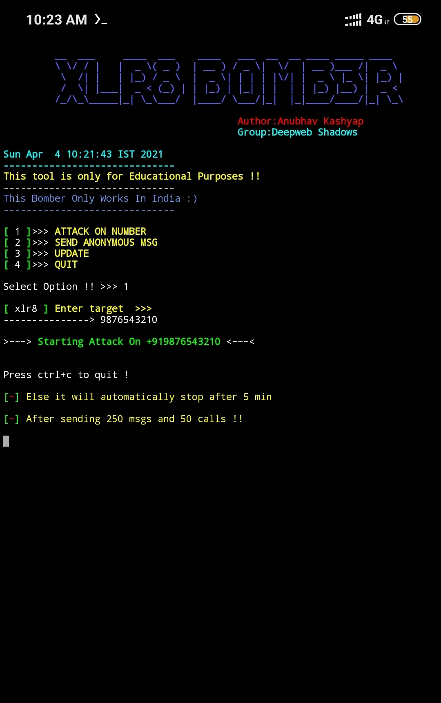

<h1 align="center">XLR8 BOMB3R 2.0
<br>
<h2 align="left">...
* 💣 📱 💀<br />
* `A Superfast SMS bomber for Linux And Termux !`

## Disclaimer
*This tool is for educational purposes only !*
_Don't use this to take revenge_<br />
*I will not be responsible for any misuse*

## About
* `Unlimited Usage !`
* `Cross Platform`
* `Supports newest Android also`
* `Working Apis`
* `No missing SMS issues, all messages will be sent.`
* `Working with all Operators/Carriers`

## Tested On :
<ul>
  <li>Kali Linux</li>
  <li>Termux</li>
  <li>Ubuntu</li>
  <li>Parrot Sec OS</li>
  <li>Mac OS</li>
  <li>Kali nethunter</li>
  <li>Alpine linux</li>
  
</ul>

## Usage
Clone it by
```bash
git clone https://github.com/anubhavanonymous/XLR8_BOMBER
```
Go to the Xlr8 Directory
```bash
cd XLR8_BOMBER
```
Just Run it
```bash
bash xlr8.sh
```
## Version
* `2.0`

## Features
* `Sms and Call Bombing`

* `Send anonymous msg`

## Note
* `This bomber only works in India !!`

## Licence
Apache 2.0 © Anubhav Kashyap


## Screenshot (Termux)

<br>
